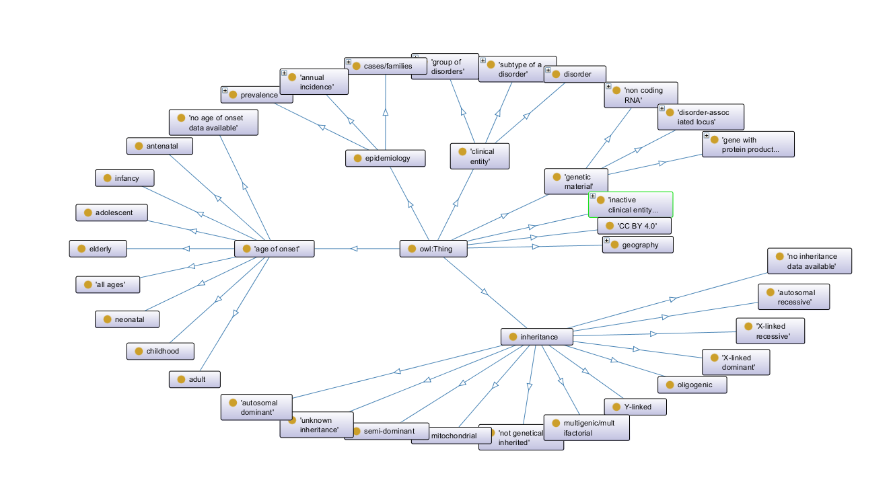

<!-- # What to do and what is done for my BS Thesis project: -->
# Project : Applying ML models on the Biomedical Ontologies for rare diseases
> Alli Khadaga Jyoth, DSE
## Immediate Problems
1. We do not have the dataset to actually do anything. The only dataset we have is [ORDO](#rare-disease-ontology-file-doid) and DOID ontologies. The dataset used in the ML4Alz paper, has 13 datasets merged to form a big dataset. Most of the datasets in that paper are availabe from the TCRD dataset. But some of the datasets require access to download and the TCRD dataset is about ~41GB in size.
2. There are no resourses (atleast I couldn't find any) available in code about how to merge two ontologies. All the resourses I could find that were using two or more ontoloies already had the merged ontologies at their disposal. They didn't have the code on how to merge the ontologies. This has made it difficult to know if my approach is correct or not and what or which approach should I follow.

## TODO list.
- [x]  Download the rare disease ontology owl (ORDO) file and explore it.
- [x]  Download other Ontologies like Human Disease Ontology (DOID).
- [x] Merge the ORDO and DOID ontologies to enrich the information present in the ORDO.
- [ ] Try to merge other ontologies also if necessary.
- [ ] When the Biocuration team is done, the important information collected by them is to be incorporated to our merged ontology
- [ ] The final goal is to develop a final ontology consisting of all the important information and then enrich it and then pass it to the other teams for them to apply ML on it to find the potential targets.
- [ ] I will also have to do some Machine Learning on my own using the mOWL library.

## Progress and Problems faced
I have managed to merge the ORDO and DOID ontologies in a prototype manner using these two methods. The two methods used are:
1. Convert the ontologies into graph and then use the graph to create triples (s, p, o). Generate these [triples](#triples-of-a-graph) for both of the ontologies. Then merge the triples which will directly merge the underlying graph therefore merging the ontologies.

2. Instead of merging the graph using the triples, define a new `equivalence` relation between the same two disease classes in each ontology. This equivalence relation acts as the bridge connecting two ontologies.   

The probelem faced
1. Even though diseases in both the ORDO and DOID have refernces to each other, the merging is not straight forward. Since the IRI's for both of them are different, I cannot directly merge them.

In the first method the problem arises that,

1. To merge the two graphs the IRI's for the merge nodes should be the same, but this is not the case since the same disease is represented using different IRI's in both the ontologies. 
    > This can be solved by replacing the node IRI with the ORDO IRI during the merging, but this dosen't solve the problem that the relations between the nodes are still represented by the DOID IRI's.
2. Which triples should be generated? Should all triples for the graph be used to merge the graph or should we selectively generate the triples to merge. 
    > So what triples should be generated? We can constraint the subject and object.  So my initial idea was to constraint the `subject` node and `object` node seperately, so to get all the outgoing and incomming edges from a disease node. But this poses a new problem that what if I have a node like `X -> B -> C -> D -> Y ` where `X, Y` are both rare diseases. This sequence of connections might or might not be present in the ontology but my method of constraining the `subject` or `object` will only fetch the triples `X -> B` and `D -> Y`, since `X, Y` are the only two rare diseases in the chain. So the full chain never forms and we might loose some information in the process.

        One solution is to append all the triples generated by the ontology graph. This has no immediate downsides I can think of right now, but it will make the graph heavy and will introduce unnecessary clutter in the graph. Then again after I merge the two graphs I will have to use SPARQL to cleanup the ontology.

In the second Method,

1. Assigining an equivalence relation between two of the same disease is an eligant solution. I did merge the ontologies with this method, but the resulting merged ontology when saved doesn't have any inherent information in it. It only saves that two ontologies were imported and an equivalence relation was estabilished between the disease classes. 
    > I haven't yet tested the effectiveness of this using SPARQL to actually query information from the merged ontology to see if linking two ontologies is enough for a parer to actually extract the information from both ontologies at the sametime. This is an issue because I read that SPARQL is unable to extract info from linked ontologies and only works on the main ontology. If this works, then this will be the goto method moving forward.

## Appendix
### Rare disease Ontology file (DOID):
> This `ordo.owl` file contains the ontology of rare diseases. All the diseases are represented in the form of `Classes`. The relationships like "Presnet in", "part of", etc are presented in form of annotations. This is different from normal/regular ontologies, since in regular ontologies, sepecific individuals are represented in form of instances of a class, but in the medical field it is common to represnt them in classes, since each disease can furthur be sub divided into sepecifics. 

Each of the disease has `DbXref` to other ontologies like DO (DOID, Disease Ontology), OMIM etc. 

### Triples of a graph 
The triples are in form of `(subject, predicate, object)`. `subject` is the starting node, `predicate` the relationship and `object` the landing node. Each triple represents a node-to-node relationship in a graph.  

If we constraint `subject` we get all the triples arising from a specific  node. If we constraint the `object` we get all the triples pointing towards a node.
